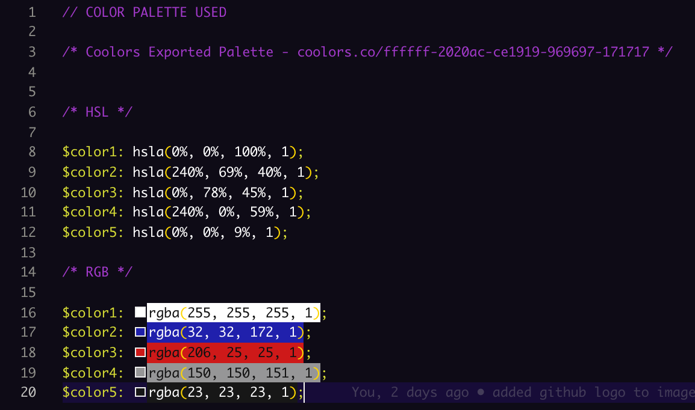

# Updated-Portfolio-Page

## Page Previews: 




## About the project:
We had to redesign our previous basic portfolio page or build a new personal portfolio web page. I chose the later. The following are the basic specs:

  Must Include:
    * Your name
    * Links to your GitHub profile & LinkedIn page as well as your email address
    * List of projects. For each project make sure you have the following:
      * Project title
      * Link to the deployed version
      * Link to the code on GitHub
  
  Additional (bonus) specs:
    * At least 3 deployed projects
    * External content:
    * Update your LinkedIn with the projects you've worked on so far
    * Update the README for each project you linked to with a description of the problem,
      how you solved it, and some information about your technical approach
    * Suggested: refactor some of your code from earlier assignments to make them more readable
    * Respnsive design
    * Color palette for your site

## Techologies used to build:
  * HTML
  * CSS
  * Bootstrap
  * jQuery
  * jQueryUI
  * Javascript
  * Font Awesome
  * Coolors.co
  * Typed.js

## Methodology:

I was looking foward to building a new portfolio page from scratch. This is by far, not the final-final, but at least I get to play around with ideas and practive my CSS and particularly Bootstrap. 

I utilized jQuery's UI library and decided to use their accordian for dividing up my about me, portfolio and contact sections. 

I used a Bootstrap Jumbotron for the title and quickly decided that I wanted to experiment with some kind of animation effect in the jumbotron. I've never coded any animations before this project but I've seen other examples from classmates and figured I want to learn this. I found the research fun. Though the end product of the animated part might seem a little elementary now, the idea is that in a few more months when I'm ready to send out job apps, this part will be a lot more advanced.

I also added some animation effects to each of the main project titles. Finally I wrapped the jumbotron's animation methods in a setTimeOut function with a setInterval function nested inside. Please see the code snippets below for more details. I was also able to add the library Typed.js and use it's typewriter effect for a section of the jumbotron.

I used a color palette from the website coolors.co. BTW, I'm horrible with matching color patterns. Just ask any girl I know and they'll tell you how I can't match colors worth bleep (mostly about fashion). I decided on a color scheme similiar to that of my VSCode editor. It's simple but to me it looks kinda neat.

I used Font Awesome to get fonts for my Github and Linkedin links, as well as for my email and mobile link/phone number in the contact section. You can even click on the email icon and it will open up your email with a new mail message ready to be sent to me.

I was able to implement Bootstrap Modals for my 3 deployed projects that I want to showcase. They seemed to be an affective way to create a specific and responsive content container for each.

## Problems That I Overcame:

The one main problem I faced was trying to get the specific modal to open correctly. At first, only the first modal would open for a featured project eventhough you clicked on one of the other two. I found out how to fix this by specifying the data-target attribute. The code snippet is below.

## Code Snippets I like:

This fixed the bug where clicking on any modal button only took you to the first one. By adding a data attriute (exp: data-target="#gifyModal"), you can target the specific modal attached to its button.
```
   <button type="button" class="btn btn-primary" data-toggle="modal" data-target="#gifyModal" id="gify-modal-button" style="display: block; margin-left: 120px;">Details</button>
```

My first Javascript animations. I used jQuery's accordian method for the main content. I created an animation effect for the jumbotron and wrapped that in a setTimeOut function with a setInterval function nested inside. I made effects for the 3 featured project titles (will be more creative next go-around!). Finally, I made a scroll button for smaller screens. I referenced jQuery's docs on animation and W3 Schools for the scroll button. The setTimeOut and setInterval functions were from previous class exercises and homework.
```
$(document).ready(function() {
  // This calls on jQuery's built-in accordian method and activates the accordian's actions.
  $('#accordion').accordion();
  // Adding background color to the accordian header. 
  $('.ui-accordion-header').css('background', 'rgba(32, 32, 172, 1)');

  // This function creates the animation in the jumbotron. Been playing around with jQuery's animation capabilities. The setTimeOut starts as soon as the page loads plays only once. The setInterval continously plays, alternating colors for the text in the jumbotron.
  setTimeout(function() {
    $('.jumbotron').animate({ height: '250px' }, 2000);
    $('.display-10').animate({ fontSize: '0px', color: 'rgba(255, 255, 255, 1);', opacity: '0.0' }, 500).animate({ fontSize: '10px', color: 'rgba(32, 32, 172, 1);', opacity: '0.5' }, 500).animate({ fontSize: '18px', color: 'rgba(206, 25, 25, 1);', opacity: '1' }, 2000).animate({ fontSize: '18px', color: 'rgba(32, 32, 172, 1)', opacity: '1' }, 1000).animate({ fontSize: '18px', color: 'rgba(206, 25, 25, 1)', opacity: '1' }, 1000).animate({ fontSize: '18px', color: 'rgba(255, 255, 255, 1)', opacity: '1' }, 1000).animate({ color: 'rgba(206, 25, 25, 1);', opacity: '1' }, 2000)
    setInterval(function() {
      $('.display-10').animate({ color: 'rgba(206, 25, 25, 1)', opacity: '1' }, 2000).animate({ color: 'rgba(255, 255, 255, 1)', opacity: '1' }, 2000).animate({ color: 'rgba(32, 32, 172, 1);', opacity: '1' }, 2000)
    })
  }, 0);

  // These mouseover events changes the color of of the project title (having a creativity mid block right now...)

  $('#train-img').on('mouseover', function() {
    $('#train-title').animate({ color: 'rgba(206, 25, 25, 1);' }, 1000).animate({ color: 'rgba(32, 32, 172, 1)' }, 1000).animate({ color: 'rgba(255, 255, 255, 1)' }, 1000).animate({ color: 'black' }, 1000);
  });

  $('#gify-img').on('mouseover', function() {
    $('#gify-title').animate({ color: 'rgba(206, 25, 25, 1);' }, 1000).animate({ color: 'rgba(32, 32, 172, 1)' }, 1000).animate({ color: 'rgba(255, 255, 255, 1)' }, 1000).animate({ color: 'black' }, 1000);
  });

  $('#trivia-img').on('mouseover', function() {
    $('#trivia-title').animate({ color: 'rgba(206, 25, 25, 1);' }, 1000).animate({ color: 'rgba(32, 32, 172, 1)' }, 1000).animate({ color: 'rgba(255, 255, 255, 1)' }, 1000).animate({ color: 'black' }, 1000);
  });

  // This is a scroll button function that shows a back to top button. It's mainly for use on smaller screeens.
  var scrollButton = document.getElementById('scroll-button');

  function showScrollButton() {
    if (document.body.scrollTop > 100 || document.documentElement.scrollTop > 100) {
      scrollButton.style.display = 'flex';
    } else {
      scrollButton.style.display = 'none';
    };
  };
  window.onscroll = function() {
    showScrollButton();
  };

  scrollButton.addEventListener('click', function() {
    document.body.scrollTop = 0;
    document.documentElement.scrollTop = 0;
  });

});
```
